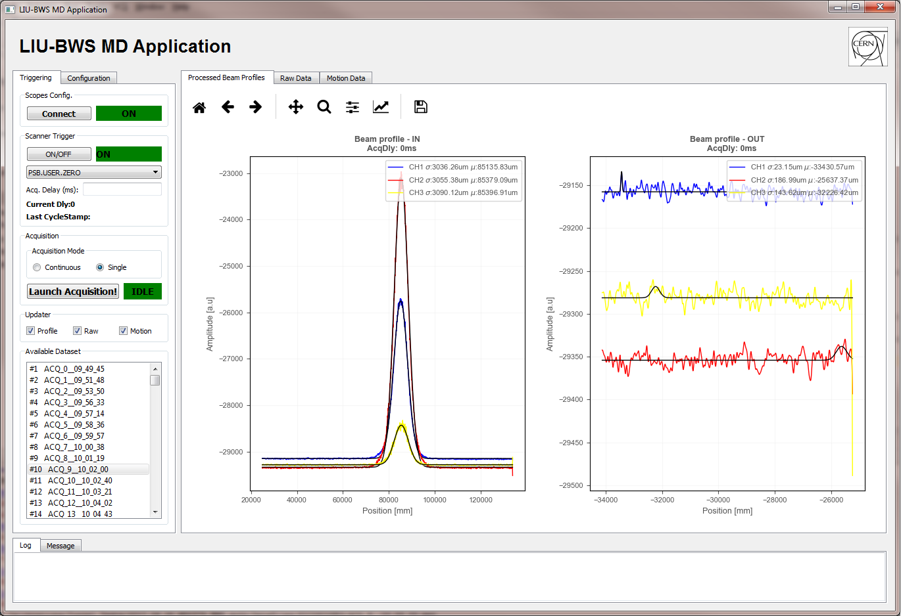

# BWS_Pycoscope 

**BWS-Pycoscope** is a Python 2.7 framwework intended for beam tests with LIU Beam Wire Scanners at CERN within the **BE-BI-PM** section, the application interacts with two USB Scopes for automatized data collection and online scan data analysis, including motion data, secondaries acquisition and global profile.

This is a user application build with PyQT and requires [Picoscope SDK drivers](https://www.picotech.com/downloads) and [Python driver bindings](https://github.com/picotech/picosdk-python-examples)

For more info go to the [complete documentation (GitHub wiki)](https://github.com/JLSirvent/BWS_Pycoscope/wiki)

